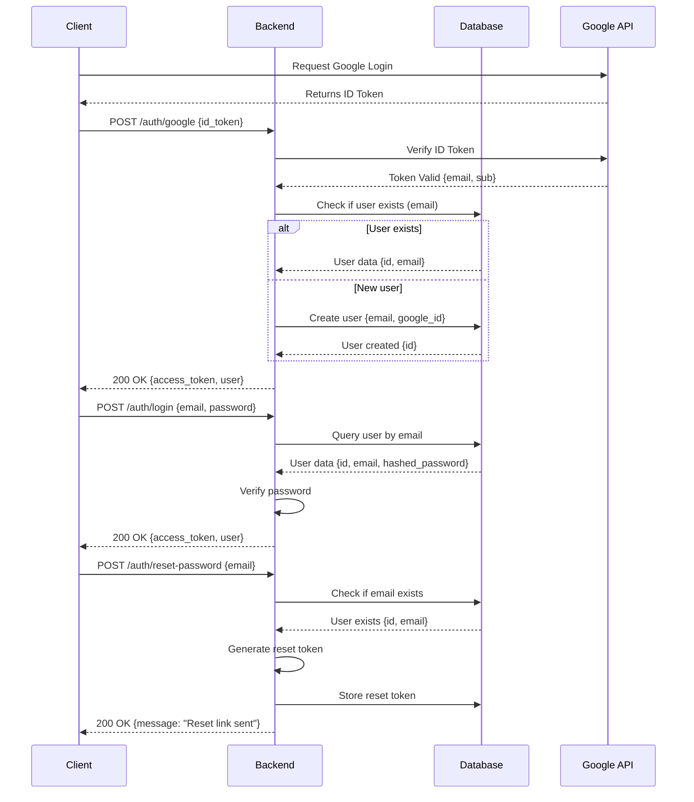

```mermaid
sequenceDiagram
    participant C as Client
    participant B as Backend
    participant D as Database
    participant G as Google API

    %% Google Authentication
    C->>G: Request Google Login
    G-->>C: Returns ID Token
    C->>B: POST /auth/google {id_token}
    B->>G: Verify ID Token
    G-->>B: Token Valid {email, sub}
    B->>D: Check if user exists (email)
    alt User exists
        D-->>B: User data {id, email}
    else New user
        B->>D: Create user {email, google_id}
        D-->>B: User created {id}
    end
    B-->>C: 200 OK {access_token, user}

    %% Local Login
    C->>B: POST /auth/login {email, password}
    B->>D: Query user by email
    D-->>B: User data {id, email, hashed_password}
    B->>B: Verify password
    B-->>C: 200 OK {access_token, user}

    %% Reset Password
    C->>B: POST /auth/reset-password {email}
    B->>D: Check if email exists
    D-->>B: User exists {id, email}
    B->>B: Generate reset token
    B->>D: Store reset token
    B-->>C: 200 OK {message: "Reset link sent"}
```